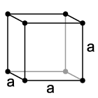

2018-09-12

# Estrutura cristalina

Todo material que apresenta uma organização na forma pela qual os átomos se agrupam, apresenta uma estrutura denominada CRISTALINA.

São estruturas formadas por unidades básica, e repetitivas, denominadas células unitárias. 

## Cristal
É um sólido formado pelo empulhamento de células unitárias.
Cristálografia é o estudo de cristais. 

## Sistemas cristalinos.
São 7 no total:
|      Sistema | Eixos       |        Ângulos        |
|-------------:|-------------|:---------------------:|
|    Cúblico   |  a = b = c  |    α = β = γ = 90°    |
|  Tretragonal |  a = b != c |    α = β = γ = 90°    |
| Ortorrombico | a != b != c |    α = β = γ = 90°    |
|  Romboédrico |  a = b = c  |   α != β != γ != 90°  |
| Hexagonal    | a = b != c  | α = β = 19°, γ = 120° |
| Monoclinico  | a != b != c | α = γ = 90°, β != 90° |
| Triclínico   | a != b != c | α != β != γ != 90°    |

## Parâmetros de Rede
São as grandezas utilizadas para descrever uma célula unitária (aresta e ângulo).

## Rede (ou grade) espacial
São linhas imáginarias que ligam os centros dos átomos. 

## Fator de empacotamento
Quantifica o nível de ocupação dos átomos em uma célula.

Da wikipedia:
```
Em cristalografia, o fator de empacotamento atômico (ou FEA) é um índice que varia de 0 a 1 e representa a fração do volume de uma célula unitária. 
Tem como objetivo informar quantos átomos podem ser organizados numa estrutura cristalina e determinar a qualidade no empilhamento. 
```

FE = Na * Va / Vc 
Onde :
* Na é o número de átomos que ocupa a célula
* Va é o volume do átomo (4/3 * pi * R^3,  onde r é o raio do átomo) 
* Vc é o volume da célula unitária. 


## Sistema cúbico
### 1. Cúbico Simples (C.S.)
Nesse arranjo os átomos ocupam os vértices de um cubo de lado "a". 

a = 1
FE = 0,52
Ver [vídeo de referência](https://www.youtube.com/watch?v=jI-RHxahQrQ)


### 2. Cúbica de corpo centrado (C.C.C.)
Os átomos ocupam os vértices e o centro do cubo de lado "a".

a = 2
FE = 0,68
Ver [vídeo de referência](https://www.youtube.com/watch?v=jI-RHxahQrQ)

### 2. Cúbica de face centrada (C.F.C.)
Nesse modelo os átomos ocupam os vértices e os centros das faces do cubo de lado "a".

a = 4
FE = 0,74
Ver [vídeo de referência](https://www.youtube.com/watch?v=jI-RHxahQrQ)


## Sistema hexagonal
### 1. Hexagonal simples (H.S.)
Os átomos ocupam os vértices de um prisma hexagonal, além dos centros das faces do prisma.

a = 1/6 átomos por vértice, mais 2 metades nas bases  = 12 * 1/6 + 2  *  1/2 = 3 átomos por célula.
FE = 0,60

### 2. Hexagonal composto (H.C.)
Átomos ocupam o vértice de um prisma hexagonal, os centros das bases, além dos centros dos 3 prismas internos. 

a = 1 átomo do prisma interno * 3, 1/6 átomos por vértice, mais 2 metades nas bases = 3 + 1/2 *2 + 12 * 1/6 = 6 átomos por célula
FE = 0,74

## Alotropia
É a propriedade que possuem centros metais de apresentar diferententes modelos de células unitária, conforme sua temperatura.

Por exemplo, o ferro puro.
|       T (ºC)      | Modelo |     Denominação    |
|:-----------------:|:------:|:------------------:|
| T < 910º          | C.C.C. | Ferro Alfa (Fe α)  |
| 910º < T < 1400º  | CFC    | Ferro Gama (Fe γ)  |
| 1400º < T < 1538º | C.C.C. | Ferro Delta (Fe δ) |


## Índice de Miller
Conjunto de números utilizados para localizar um plano atômico na estrutura cristalina. 

Procedimento para determinar índice de Miller: 
a. escolha plano quye não passe pela origem, do sistema referencial.
b. determine pontos de interceptação do plano no eixo x, y, z. 
c. obtenha os inversos das interceptações.
d. obtenha os menores inteiros para representar o plano.
e. apresentar índices obtidos entre parentes, e sem vírgula.

Ex (0 0 1), (1 1 0), etc.
